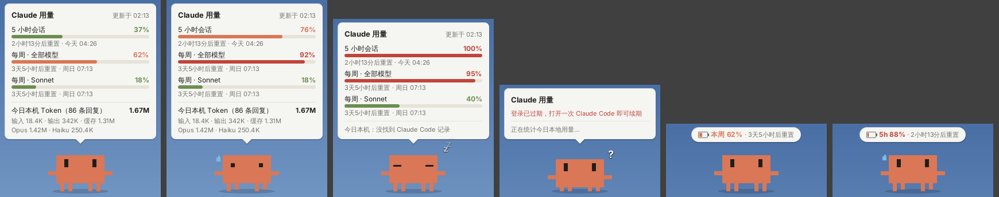

# 小 Clawd 桌宠

一只常驻桌面的小 Clawd，随时显示你的 Claude 用量：

- **每种额度的用量**：5 小时会话、每周（全部模型）、每周 Sonnet / Opus 等，账号有哪些就显示哪些
- **每项额度的重置时间**：倒计时 + 具体时刻（如「2小时13分后重置 · 今天 18:00」），到点自动刷新
- **今日用量**：今天本机 Claude Code 消耗的 token（输入 / 输出 / 缓存、回复条数、按模型拆分）

从左到右：正常 → 用得多了冒汗 → 额度用光睡觉（没电了） → 读取失败 → 收起状态 → 收起时鼠标悬停打招呼。

## 运行

需要 JDK 17 或更高版本，不需要任何第三方库。

| 系统 | 启动 |
| --- | --- |
| Windows | 双击 `run.bat` |
| macOS / Linux | `./run.sh` |
| IDE | 把 `clawd-pet/src` 设为源码目录，运行 `clawd.ClawdPet` |

想先看看样子，可以加 `--demo` 参数，用假数据预览。

## 操作

- **左键点 Clawd**：展开 / 收起面板（收起后只显示最吃紧的那一项）
- **按住拖动**：移动位置，下次启动会记住
- **双击面板**：立即刷新
- **右键**：立即刷新、始终置顶、设置 / 清除长期令牌、退出

## 数据从哪来

**订阅额度**：读取本机 Claude Code 的登录令牌，查询 Claude Code `/usage` 命令背后用的同一个接口。令牌按以下顺序查找：

1. 环境变量 `CLAUDE_CODE_OAUTH_TOKEN`，或右键菜单里设置的长期令牌
2. `~/.claude/.credentials.json`（Windows 为 `%USERPROFILE%\.claude\.credentials.json`）
3. macOS 钥匙串中的 `Claude Code-credentials`

所以请先在这台电脑上用 Pro / Max 账号登录过 Claude Code。这个令牌几个小时就会过期，平时用 Claude Code 时会自动续期；如果你很少在本机用 Claude Code，可以改用长期令牌：

1. 在终端运行 `claude setup-token`，按提示登录，复制最后打印出的 `sk-ant-oat01-…`
2. 右键 Clawd →「设置长期令牌…」，粘贴保存（保存在 `~/.clawd-pet/token`，只在本机）

不想用了就右键「清除长期令牌」，会改回读取 Claude Code 的登录。

额度每 5 分钟查询一次（该接口有频率限制，不建议更频繁）。需要代理时，设置 `HTTPS_PROXY` 环境变量（如 `http://127.0.0.1:7890`），否则使用系统代理。

**今日 token**：统计 `~/.claude/projects` 下今天的会话日志，只在本地读取，每分钟更新一次。网页版 / App 里的对话不会写入这些日志，只计入上面的订阅额度。

> 额度接口不是公开文档里的 API，以后如果有变化，可能需要更新 `UsageClient.java`。

## 代码结构

| 文件 | 作用 |
| --- | --- |
| `ClawdPet.java` | 入口：透明窗口、拖动、右键菜单、定时刷新 |
| `PetPanel.java` | 画 Clawd 和用量面板，以及眨眼、踏步、冒汗、睡觉等动画 |
| `UsageClient.java` | 查找登录令牌，请求并解析订阅额度 |
| `LocalUsageScanner.java` | 统计本地日志里今天的 token（按消息去重、按文件缓存） |
| `Usage.java` | 数据结构 |
| `Fmt.java` | 数字、倒计时、时刻的中文格式化 |
| `Json.java` | 极简 JSON 解析器 |
| `ClaudePaths.java` | Claude Code 配置目录的位置 |
